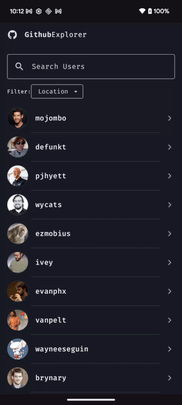

# 🚀 GitHub Explorer

A modern Android app built with Jetpack Compose to explore GitHub users and their repositories, with support for pagination, search, filters, and more.

---

## 📱 App Demo





---

## ✨ Features

- 🔍 Search GitHub users
- 🌍 Filter by location
- 📄 Paginated user listing
- 🧊 Shimmer loading UI
- ❌ Empty and error state handling
- 🔐 GitHub token secured via local `gradle.properties`


## 🔐 GitHub Access Token Setup

To authenticate with the GitHub API and avoid rate-limiting, this project requires a **GitHub Personal Access Token (PAT)**.

### ✅ 1. Create a Personal Access Token

1. Go to [GitHub Developer Settings → Tokens](https://github.com/settings/tokens)
2. Click **"Generate new token"**
3. Select **`public_repo`** scope (for public repository access)
4. Copy the token — you’ll use it in the next step

### 🛠️ 2. Add the Token to `local.properties`

Create or edit the `local.properties` file at the root of your project:

> ⚠️ Do **not** commit this file. It is ignored by Git for security.

### 📦 3. Using the Token in Code

The token is automatically exposed via `BuildConfig.GITHUB_TOKEN` (from your Gradle setup).  
You can use it in your code like this:

```kotlin
val token = BuildConfig.GITHUB_TOKEN


